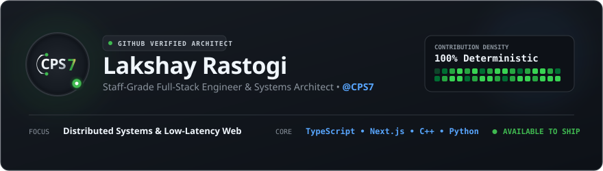

<div align="center">

<!-- BESPOKE GITHUB SPECIAL EDITION HERO BANNER -->


</div>

<br/>

### `whoami`

I am **Lakshay Rastogi** (`@CPS7`), a full-stack engineer and systems architect. 

I build software where architectural rigor matters as much as user experience. My work spans low-latency distributed backends, deterministic terminal CLIs, and modern web platforms engineered to scale seamlessly under heavy production load.

```
● Systems Built:   20+ Shipped Modules
⚡ Core Focus:      Distributed Systems • Low-Latency APIs • Next.js Full-Stack
📍 Status:          Active & Building • Open for High-Impact Roles & Collaborations
```

<br/>

<div align="center">
  
</div>

<br/>

## 📌 Pinned Repositories

<table>
  <tr>
    <td width="50%" valign="top">
      <div align="left">
        <b>🪙 <a href="https://github.com/CPS7/Expense-Tracker-CLI">Expense-Tracker-CLI</a></b>
        <br/><br/>
        <p>A fast, local-first terminal personal finance ledger engine with structured SQLite persistence, instant analytics generation, and structured reporting pipelines.</p>
        <p>
          <span style="color:#F2CC60;">●</span> <code>C++ / Python</code> &nbsp;&nbsp;
          <span style="color:#58A6FF;">●</span> <code>SQLite Engine</code> &nbsp;&nbsp;
          <span style="color:#3FB950;">●</span> <code>CLI Tooling</code>
        </p>
      </div>
    </td>
    <td width="50%" valign="top">
      <div align="left">
        <b>⚡ <a href="https://github.com/CPS7">Distributed Audio Infrastructure</a></b>
        <br/><br/>
        <p>Real-time streaming and event orchestration nodes integrated with Lavalink audio pipelines for zero-latency audio distribution across concurrent sessions.</p>
        <p>
          <span style="color:#3FB950;">●</span> <code>Node.js</code> &nbsp;&nbsp;
          <span style="color:#58A6FF;">●</span> <code>WebSockets</code> &nbsp;&nbsp;
          <span style="color:#BC8CFF;">●</span> <code>Docker</code>
        </p>
      </div>
    </td>
  </tr>
  <tr>
    <td width="50%" valign="top">
      <div align="left">
        <b>🌐 <a href="https://github.com/CPS7">Modern Web Platforms</a></b>
        <br/><br/>
        <p>Production web architectures built with Next.js 15, React 19, TypeScript, and edge caching for sub-10ms response times and optimistic UI updates.</p>
        <p>
          <span style="color:#58A6FF;">●</span> <code>Next.js 15</code> &nbsp;&nbsp;
          <span style="color:#3FB950;">●</span> <code>TypeScript</code> &nbsp;&nbsp;
          <span style="color:#38BDF8;">●</span> <code>Tailwind</code>
        </p>
      </div>
    </td>
    <td width="50%" valign="top">
      <div align="left">
        <b>🧠 <a href="https://github.com/CPS7">Autonomous AI Pipelines</a></b>
        <br/><br/>
        <p>Context-aware workflow automation integrating vector retrieval, structured LLM function calling, and automated background data processing pipelines.</p>
        <p>
          <span style="color:#BC8CFF;">●</span> <code>Python</code> &nbsp;&nbsp;
          <span style="color:#58A6FF;">●</span> <code>FastAPI</code> &nbsp;&nbsp;
          <span style="color:#F2CC60;">●</span> <code>Vector DB</code>
        </p>
      </div>
    </td>
  </tr>
</table>

<br/>

<div align="center">
  
</div>

<br/>

## 🛠️ Technical Arsenal

<table>
  <thead>
    <tr>
      <th width="25%" align="left">Domain</th>
      <th width="75%" align="left">Technologies &amp; Tools</th>
    </tr>
  </thead>
  <tbody>
    <tr>
      <td><b>Languages</b></td>
      <td><code>TypeScript</code> • <code>JavaScript</code> • <code>Python</code> • <code>C++</code> • <code>Go</code> • <code>SQL</code></td>
    </tr>
    <tr>
      <td><b>Frontend</b></td>
      <td><code>React 19</code> • <code>Next.js 15</code> • <code>TailwindCSS</code> • <code>HTML5/CSS3</code> • <code>WebSockets</code></td>
    </tr>
    <tr>
      <td><b>Backend &amp; APIs</b></td>
      <td><code>Node.js</code> • <code>Express</code> • <code>FastAPI</code> • <code>RESTful APIs</code> • <code>GraphQL</code></td>
    </tr>
    <tr>
      <td><b>Data &amp; Persistence</b></td>
      <td><code>PostgreSQL</code> • <code>SQLite</code> • <code>Redis</code> • <code>MongoDB</code></td>
    </tr>
    <tr>
      <td><b>Cloud &amp; DevOps</b></td>
      <td><code>Docker</code> • <code>Git / GitHub Actions</code> • <code>Linux</code> • <code>Cloudflare</code> • <code>Vercel</code></td>
    </tr>
  </tbody>
</table>

<br/>

<div align="center">
  
</div>

<br/>

## 📊 Contribution Velocity & Telemetry

<div align="center">
  <table border="0" cellspacing="0" cellpadding="0">
    <tr>
      <td>
        
      </td>
      <td>
        
      </td>
    </tr>
  </table>
</div>

<br/>

<div align="center">
  
</div>

<br/>

## 📬 Connect & Direct Transmission

Open for technical architecture discussions, senior/staff engineering opportunities, and ambitious open-source collaborations.

<div align="center">
  <br/>
  <a href="https://github.com/CPS7">
    
  </a>
  &nbsp;
  <a href="https://linkedin.com/in/">
    
  </a>
  &nbsp;
  <a href="https://twitter.com/">
    
  </a>
  &nbsp;
  <a href="mailto:contact@cps7.dev">
    
  </a>

  <br/><br/>
  <sub><b>Lakshay Rastogi (@CPS7)</b> • Engineered with care for GitHub • 2026</sub>
</div>
