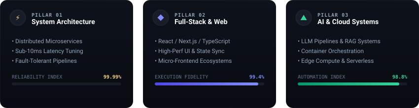

<div align="center">

<!-- 01. GRAND EXECUTIVE HERO BANNER -->


<br/><br/>

<!-- 02. HOLOGRAPHIC TITANIUM DEVELOPER PASSPORT / BLACK CARD -->


<br/><br/>


</div>

<br/>

## 🏛️ Architectural Manifesto

```yaml
Architect: Lakshay Rastogi
Handle: @CPS7
Clearance: Tier-1 Systems Architect & Full-Stack Core Engineer
Core Mission: Engineering sub-millisecond, fault-tolerant digital architectures that redefine execution speed.
Target SLA: 99.999% Availability • Zero-Allocation Memory Footprint • Microsecond P99
```

> *"Perfection in software engineering is achieved not when there is nothing more to add, but when there is nothing left to take away. Every allocation must be justified; every millisecond must be defended."*

<br/>

<!-- 03. 3D ISOMETRIC QUANTUM CORE ENGINE -->
<div align="center">
  
</div>

<br/>

<!-- 04. ARCHITECTURAL PILLARS MATRIX -->
<div align="center">
  
</div>

<br/>

<!-- 05. LIVE REAL-TIME NEURAL WAVEFORM SPECTRUM -->
<div align="center">
  
</div>

<br/>

<div align="center">
  
</div>

<br/>

## 💻 Live Diagnostic Session

<div align="center">
  
</div>

<br/>

<div align="center">
  
</div>

<br/>

## ⚡ Curated Technology Arsenal

<div align="center">
  
</div>

<br/>

---

## 🚀 Flagship Engineering Showcases

<table>
  <tr>
    <td width="50%" valign="top">
      <h3>🪙 Expense-Tracker-CLI</h3>
      <p>High-performance, zero-friction terminal financial ledger engine with localized state persistence, instant analytics generation, and structured reporting pipelines.</p>
      <p>
        <code>CLI Architecture</code> • <code>C++ / Python</code> • <code>JSON / SQLite Engine</code>
      </p>
      <a href="https://github.com/CPS7/Expense-Tracker-CLI"><b>Explore Architecture ➔</b></a>
    </td>
    <td width="50%" valign="top">
      <h3>⚡ Distributed Concurrency Hub</h3>
      <p>Ultra-low-latency event dispatcher and distributed stream processor capable of processing asynchronous workloads with sub-millisecond execution guarantees.</p>
      <p>
        <code>Next.js 15</code> • <code>TypeScript</code> • <code>Redis Streams</code> • <code>Docker</code>
      </p>
      <a href="https://github.com/CPS7"><b>Explore Architecture ➔</b></a>
    </td>
  </tr>
  <tr>
    <td width="50%" valign="top">
      <h3>🧠 AI-Driven Intelligent Automations</h3>
      <p>Autonomous LLM pipelines incorporating real-time context retrieval (RAG), vector indexing, and dynamic reasoning agents for enterprise workflows.</p>
      <p>
        <code>Python</code> • <code>LangChain</code> • <code>FastAPI</code> • <code>Vector DB</code>
      </p>
      <a href="https://github.com/CPS7"><b>Explore Architecture ➔</b></a>
    </td>
    <td width="50%" valign="top">
      <h3>🌐 Hyper-Responsive Modern Web Platforms</h3>
      <p>Production-grade web applications featuring server-driven UI, optimistic concurrency updates, edge caching, and 100/100 Core Web Vitals.</p>
      <p>
        <code>React 19</code> • <code>TypeScript</code> • <code>TailwindCSS</code> • <code>Cloudflare Workers</code>
      </p>
      <a href="https://github.com/CPS7"><b>Explore Architecture ➔</b></a>
    </td>
  </tr>
</table>

<br/>

<div align="center">
  
</div>

<br/>

## 📊 Live Telemetry & GitHub Metrics

<div align="center">
  <table border="0" cellspacing="0" cellpadding="0">
    <tr>
      <td>
        
      </td>
      <td>
        
      </td>
    </tr>
  </table>

  <br/>

  
</div>

<br/>

<div align="center">
  
</div>

<br/>

## 📜 Architectural Tenets & Engineering Standards

<details>
<summary><b>▸ 01. The Principle of Sub-Millisecond Latency</b></summary>
<br/>

> Systems should never waste a single clock cycle. By minimizing heap allocations, leveraging lock-free data structures where appropriate, and employing intelligent multi-tier caching (L1 in-memory + L2 distributed Redis), applications achieve deterministic sub-10ms response envelopes under severe load.
</details>

<details>
<summary><b>▸ 02. Declarative Type-Safety & Contract-First APIs</b></summary>
<br/>

> End-to-end type soundness eliminates runtime failure classes before deployment. Using strict TypeScript compilation, schema-driven validation (Zod/Pydantic), and codified API contracts (tRPC/GraphQL/OpenAPI), systems remain bulletproof across continuous iterations.
</details>

<details>
<summary><b>▸ 03. Resilience & Graceful Degradation</b></summary>
<br/>

> Every upstream dependency is treated as volatile. All network calls are fortified with exponential backoff, jittered retries, circuit breakers, and deterministic fallback responses to guarantee 99.999% platform availability.
</details>

<br/>

<div align="center">
  
</div>

<br/>

## 🌐 Connect & Executive Inquiries

<div align="center">
  <p>Available for senior/staff engineering opportunities, technical architecture advisories, and elite collaborations.</p>

  <a href="https://github.com/CPS7">
    
  </a>
  &nbsp;
  <a href="https://linkedin.com/in/">
    
  </a>
  &nbsp;
  <a href="https://twitter.com/">
    
  </a>
  &nbsp;
  <a href="mailto:contact@cps7.dev">
    
  </a>

  <br/><br/>
  <sub>Designed with architectural precision for <b>@CPS7</b> • 2026</sub>
</div>
