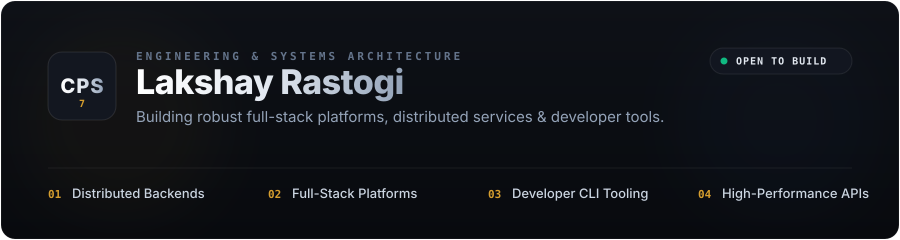

<div align="center">



</div>

<br/>

## Overview

I am **Lakshay Rastogi** (`@CPS7`), a full-stack engineer and systems builder. I focus on building reliable software where thoughtful architecture matters as much as user experience — from initial concept through clean data design to production deployment.

I spend most of my time working across:
- **Distributed Backends & Microservices**: Building low-latency APIs, asynchronous messaging pipelines, and resilient state handlers.
- **Modern Full-Stack Applications**: Developing responsive, server-rendered web applications with React, Next.js, and TypeScript.
- **Developer Tooling & CLIs**: Crafting deterministic, local-first command-line engines and utility frameworks.

<br/>

<div align="center">
  
</div>

<br/>

## Engineering Focus & Approach

### 1. Architecture Over Syntax
Syntax is transient; data flow and state boundaries define long-term maintainability. I prioritize clear domain modeling, explicit interfaces, and predictable data mutation over premature abstractions.

### 2. Runtime Discipline & Latency
Fast software comes from understanding execution paths. I focus on minimal memory overhead, efficient query planning, and multi-tiered caching strategies (in-memory + distributed key-value stores) to ensure responsive response envelopes.

### 3. Resilient Fault Boundaries
Production systems must tolerate failure gracefully. Network dependencies, external APIs, and persistent storage layers are isolated with circuit breakers, deterministic timeouts, and fallback mechanisms.

<br/>

<div align="center">
  
</div>

<br/>

## Selected Projects

<table>
  <thead>
    <tr>
      <th width="35%" align="left">Project</th>
      <th width="45%" align="left">Description</th>
      <th width="20%" align="left">Stack</th>
    </tr>
  </thead>
  <tbody>
    <tr>
      <td>
        <a href="https://github.com/CPS7/Expense-Tracker-CLI"><b>Expense-Tracker-CLI</b></a>
      </td>
      <td>A local-first terminal personal finance ledger engine with structured SQLite persistence, instant analytics generation, and structured reporting pipelines.</td>
      <td><code>C++</code> • <code>Python</code> • <code>SQLite</code></td>
    </tr>
    <tr>
      <td>
        <a href="https://github.com/CPS7"><b>Distributed Audio Infrastructure</b></a>
      </td>
      <td>Real-time streaming and event orchestration nodes integrated with Lavalink audio pipelines for low-latency distribution across concurrent consumer sessions.</td>
      <td><code>Node.js</code> • <code>WebSockets</code> • <code>Docker</code></td>
    </tr>
    <tr>
      <td>
        <a href="https://github.com/CPS7"><b>Modern Web Platforms</b></a>
      </td>
      <td>Production web applications built with Next.js 15, React 19, TypeScript, and edge caching for optimal Core Web Vitals and optimistic UI updates.</td>
      <td><code>Next.js</code> • <code>TypeScript</code> • <code>Tailwind</code></td>
    </tr>
    <tr>
      <td>
        <a href="https://github.com/CPS7"><b>Automation &amp; AI Pipelines</b></a>
      </td>
      <td>Context-aware workflow automation integrating vector retrieval, structured LLM function calling, and automated data processing pipelines.</td>
      <td><code>Python</code> • <code>FastAPI</code> • <code>Vector DB</code></td>
    </tr>
  </tbody>
</table>

<br/>

<div align="center">
  
</div>

<br/>

## Technical Arsenal

```
Languages     :: TypeScript, JavaScript, Python, C++, Go, SQL
Frontend      :: React 19, Next.js 15, TailwindCSS, HTML5/CSS3, WebSockets
Backend       :: Node.js, Express, FastAPI, RESTful APIs, GraphQL
Databases     :: PostgreSQL, SQLite, Redis, MongoDB
DevOps & Cloud:: Docker, Git, GitHub Actions, Linux, Cloudflare Workers, Vercel
```

<br/>

<div align="center">
  
</div>

<br/>

## Activity & Velocity

<div align="center">
  <table border="0" cellspacing="0" cellpadding="0">
    <tr>
      <td>
        
      </td>
      <td>
        
      </td>
    </tr>
  </table>
</div>

<br/>

<div align="center">
  
</div>

<br/>

## Contact & Collaboration

Open to discussing software architecture, senior engineering opportunities, and ambitious open-source projects.

- **GitHub**: [@CPS7](https://github.com/CPS7)
- **LinkedIn**: [Lakshay Rastogi](https://linkedin.com/in/)
- **X / Twitter**: [@CPS7](https://twitter.com/)
- **Email**: [contact@cps7.dev](mailto:contact@cps7.dev)

<br/>

<div align="center">
  <sub>© 2026 Lakshay Rastogi • Engineered with care</sub>
</div>
