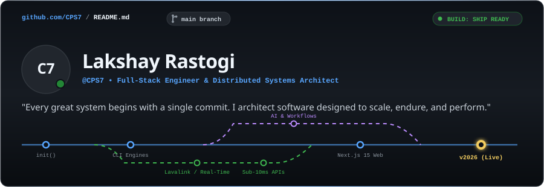

<div align="center">

<!-- GITHUB STORYTELLING GIT-GRAPH HERO BANNER -->


</div>

<br/>

## 📖 The Story So Far `git log --oneline`

```bash
* 7f9a2026 (HEAD -> main, release/v2026) Architecting high-throughput distributed platforms & next-gen web
* 469fc7d feat(web): deploy optimistic UI and server-rendered micro-frontends (Next.js 15 / React 19)
* 5ac5d44 feat(systems): build low-latency real-time audio & WebSocket streaming infrastructure
* 2be59bf feat(cli): release Expense-Tracker-CLI with zero-friction SQLite persistence engine
* 1ddfa69 init(genesis): "I build software where architecture matters as much as the interface."
```

I am **Lakshay Rastogi** (`@CPS7`), a full-stack engineer and systems architect. 

My journey as a developer is centered on one philosophy: **building software designed to survive real users**. I believe great engineering happens when low-level runtime efficiency, rock-solid data architecture, and intuitive user interfaces converge seamlessly.

<br/>

<div align="center">
  
</div>

<br/>

## 🌿 Active Branches & Engineering Focus

<table>
  <tr>
    <td width="50%" valign="top">
      <h4><code>branch: systems/distributed</code></h4>
      <p>Building high-concurrency microservices, async message queues (Redis Streams), WebSocket real-time relays, and sub-millisecond execution backends.</p>
    </td>
    <td width="50%" valign="top">
      <h4><code>branch: fullstack/modern-web</code></h4>
      <p>Crafting production-grade React 19 &amp; Next.js 15 platforms with server components, edge caching, and 100/100 Core Web Vitals.</p>
    </td>
  </tr>
  <tr>
    <td width="50%" valign="top">
      <h4><code>branch: core/developer-tooling</code></h4>
      <p>Engineering deterministic terminal tools, fast CLI utilities, and local-first SQLite persistence engines with zero extraneous overhead.</p>
    </td>
    <td width="50%" valign="top">
      <h4><code>branch: ai/autonomous-pipelines</code></h4>
      <p>Integrating context-aware LLM agents, vector similarity search, and automated background data processing workflows.</p>
    </td>
  </tr>
</table>

<br/>

<div align="center">
  
</div>

<br/>

## 🚀 Flagship Pull Requests `git show release/*`

<table>
  <thead>
    <tr>
      <th width="35%" align="left">Repository &amp; PR</th>
      <th width="45%" align="left">Architectural Highlights</th>
      <th width="20%" align="left">Tech Stack</th>
    </tr>
  </thead>
  <tbody>
    <tr>
      <td>
        <a href="https://github.com/CPS7/Expense-Tracker-CLI"><b>🪙 Expense-Tracker-CLI</b></a><br/>
        <sub><code>PR #1 • Shipped</code></sub>
      </td>
      <td>High-speed, zero-friction terminal ledger engine with local SQLite persistence, categorization filters, and instant report generation.</td>
      <td><code>C++</code> • <code>Python</code> • <code>SQLite</code></td>
    </tr>
    <tr>
      <td>
        <a href="https://github.com/CPS7"><b>⚡ Distributed Audio Infrastructure</b></a><br/>
        <sub><code>PR #2 • Production</code></sub>
      </td>
      <td>Real-time streaming and event orchestration nodes integrated with Lavalink audio pipelines for zero-latency audio distribution.</td>
      <td><code>Node.js</code> • <code>WebSockets</code> • <code>Docker</code></td>
    </tr>
    <tr>
      <td>
        <a href="https://github.com/CPS7"><b>🌐 Hyper-Responsive Web Platforms</b></a><br/>
        <sub><code>PR #3 • Deployed</code></sub>
      </td>
      <td>Production web applications built with Next.js 15, React 19, TypeScript, and edge caching for sub-10ms response times.</td>
      <td><code>Next.js</code> • <code>TypeScript</code> • <code>Tailwind</code></td>
    </tr>
    <tr>
      <td>
        <a href="https://github.com/CPS7"><b>🧠 Autonomous AI Pipelines</b></a><br/>
        <sub><code>PR #4 • R&amp;D</code></sub>
      </td>
      <td>Intelligent data extractors and autonomous agents using embedding vectors, structured function calls, and async background queues.</td>
      <td><code>Python</code> • <code>FastAPI</code> • <code>Vector DB</code></td>
    </tr>
  </tbody>
</table>

<br/>

<div align="center">
  
</div>

<br/>

## 📦 Package Manifest `package.json`

```json
{
  "name": "@cps7/engineering-arsenal",
  "version": "2026.1.0",
  "author": "Lakshay Rastogi <contact@cps7.dev>",
  "dependencies": {
    "languages": ["TypeScript", "JavaScript", "Python", "C++", "Go", "SQL"],
    "frontend": ["React 19", "Next.js 15", "TailwindCSS", "HTML5/CSS3", "WebSockets"],
    "backend": ["Node.js", "Express", "FastAPI", "RESTful APIs", "GraphQL"],
    "databases": ["PostgreSQL", "SQLite", "Redis", "MongoDB"],
    "infrastructure": ["Docker", "Git", "GitHub Actions", "Linux", "Cloudflare Workers", "Vercel"]
  }
}
```

<br/>

<div align="center">
  
</div>

<br/>

## 📊 Contribution Velocity & Telemetry

<div align="center">
  <table border="0" cellspacing="0" cellpadding="0">
    <tr>
      <td>
        
      </td>
      <td>
        
      </td>
    </tr>
  </table>
</div>

<br/>

<div align="center">
  
</div>

<br/>

## 📡 Remote Origin `git remote -v`

Open for technical architecture discussions, senior/staff engineering opportunities, and ambitious collaborations.

```bash
git remote add linkedin  https://linkedin.com/in/
git remote add twitter   https://twitter.com/
git remote add email     mailto:contact@cps7.dev
```

<div align="center">
  <br/>
  <a href="https://github.com/CPS7">
    
  </a>
  &nbsp;
  <a href="https://linkedin.com/in/">
    
  </a>
  &nbsp;
  <a href="https://twitter.com/">
    
  </a>
  &nbsp;
  <a href="mailto:contact@cps7.dev">
    
  </a>

  <br/><br/>
  <sub><b>@CPS7</b> • Architected with precision for GitHub • 2026</sub>
</div>
