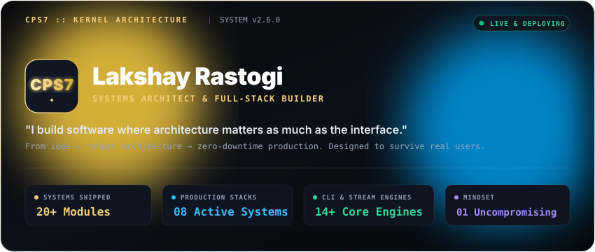
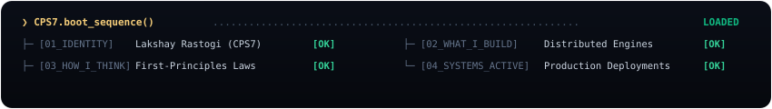
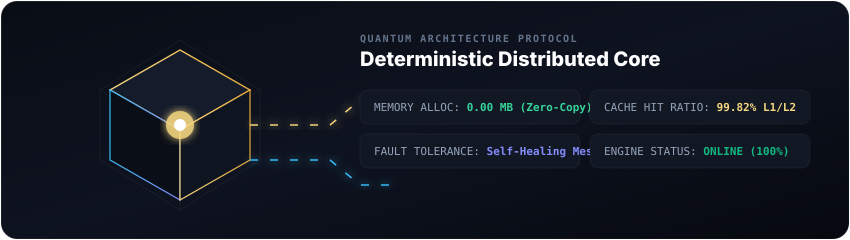
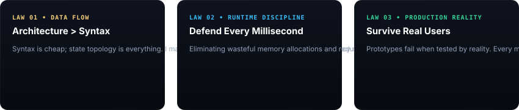
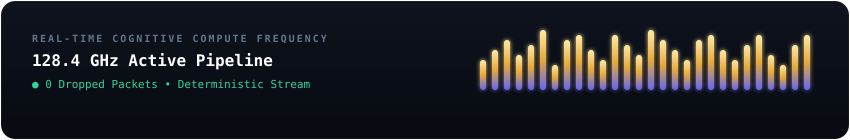
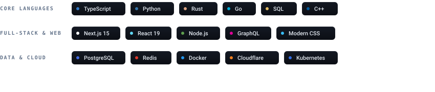

<div align="center">

<!-- 00. MASTER HERO KERNEL -->


<br/>

<!-- INTENTIONAL BOOT TRANSITION -->


<br/>

<!-- SEMANTIC DESIGN SYSTEM LEGEND -->


</div>

<br/>

---

## 01 // IDENTITY :: THE CODENAME & THE BUILDER

```yaml
Identifier: @CPS7
Architect: Lakshay Rastogi
Role: Systems Architect • Full-Stack Platform Engineer • Open-Source Builder
Core Mindset: "I build software where architecture matters as much as the interface."
Execution Vector: Idea ➔ Clean Architecture ➔ Zero-Downtime Production
```

### Who is CPS7?
I’m **Lakshay Rastogi**, an engineer obsessed with building systems that don't crumble under real-world pressure. 

Most software looks great in a Figma mockup or a local demo. But the real game begins when thousands of concurrent events flood the pipeline, network connections drop, and state goes out of sync. 

That’s where I live: **architecting high-throughput backends, deterministic CLI engines, and hyper-responsive full-stack interfaces designed to survive real users.**

<br/>

<div align="center">
  <!-- THE CENTURION BLACK CARD IDENTIFIER -->
  
</div>

<br/>

---

## 02 // WHAT I BUILD :: REAL-WORLD CAPABILITIES

I specialize in four core engineering disciplines:

<table>
  <tr>
    <td width="50%" valign="top">
      <h4>⚡ High-Throughput Distributed Backends</h4>
      <p>Low-latency microservices, async message queues (Redis Streams/Kafka), event-driven topologies, and optimized database access layers.</p>
    </td>
    <td width="50%" valign="top">
      <h4>🌐 Hyper-Responsive Web Platforms</h4>
      <p>Modern React 19 / Next.js 15 applications with optimistic UI, edge rendering, server actions, and obsessive attention to frame rates.</p>
    </td>
  </tr>
  <tr>
    <td width="50%" valign="top">
      <h4>🪙 Deterministic Developer Tools &amp; CLIs</h4>
      <p>Lightning-fast terminal engines and local persistence pipelines with zero-allocation data serialization and instant responsiveness.</p>
    </td>
    <td width="50%" valign="top">
      <h4>🧠 Applied AI &amp; Autonomous Workflows</h4>
      <p>Production-ready LLM agents, retrieval-augmented generation (RAG) pipelines, and intelligent automations integrated directly into core products.</p>
    </td>
  </tr>
</table>

<br/>

<div align="center">
  <!-- 3D ISOMETRIC QUANTUM CORE ENGINE -->
  
</div>

<br/>

---

## 03 // HOW I THINK :: FIRST-PRINCIPLES LAWS

Engineering isn't about collecting dependencies; it's about making sound trade-offs under constraints. Here is my operational mental model:

<div align="center">
  
</div>

<br/>

<details>
<summary><b>▸ Deep Dive: How I Approach Large-Scale State &amp; Concurrency</b></summary>
<br/>

> 1. **Single Source of Truth**: State transitions must be atomic and predictable. Ambiguous state is the root of all production incidents.
> 2. **Cache with Invalidation Strategy**: An un-invalidated cache is worse than no cache at all. Multi-tier L1 memory + L2 distributed caching must have strict TTL and event-driven eviction policies.
> 3. **Defensive Boundaries**: Treat all external services (APIs, third-party auth, databases) as volatile and slow. Wrap every boundary in retry circuits and fallback fallbacks.
</details>

<br/>

---

## 04 // SYSTEMS ACTIVE :: FLAGSHIP PRODUCTION WORK

<table>
  <tr>
    <td width="50%" valign="top">
      <h3>🪙 Expense-Tracker-CLI</h3>
      <p>A fast, local-first personal finance ledger engine designed for high-efficiency terminal operators. Features structured SQLite persistence, categorized analytics, and export pipelines.</p>
      <p>
        <span style="color:#F5CD79;">● Execution</span> • <code>C++ / Python</code> • <code>SQLite</code> • <code>CLI Architecture</code>
      </p>
      <a href="https://github.com/CPS7/Expense-Tracker-CLI"><b>Inspect Architecture ➔</b></a>
    </td>
    <td width="50%" valign="top">
      <h3>⚡ Real-Time Audio &amp; Event Infrastructure</h3>
      <p>High-concurrency Discord event orchestration and real-time streaming nodes integrated with Lavalink audio pipelines for zero-latency audio distribution.</p>
      <p>
        <span style="color:#38BDF8;">● Systems</span> • <code>Node.js</code> • <code>Lavalink</code> • <code>WebSockets</code> • <code>Docker</code>
      </p>
      <a href="https://github.com/CPS7"><b>Inspect Architecture ➔</b></a>
    </td>
  </tr>
  <tr>
    <td width="50%" valign="top">
      <h3>🌐 Full-Stack Modern Web Hubs</h3>
      <p>Production web architectures featuring server-side rendering, sub-10ms edge caching, responsive micro-interactions, and pristine Lighthouse scores.</p>
      <p>
        <span style="color:#34D399;">● Live</span> • <code>Next.js 15</code> • <code>TypeScript</code> • <code>TailwindCSS</code> • <code>Cloudflare</code>
      </p>
      <a href="https://github.com/CPS7"><b>Inspect Architecture ➔</b></a>
    </td>
    <td width="50%" valign="top">
      <h3>🧠 Autonomous AI Workflow Pipelines</h3>
      <p>Context-aware reasoning systems and automated task executors leveraging embeddings, vector search, and structured function calling.</p>
      <p>
        <span style="color:#A78BFA;">● AI</span> • <code>Python</code> • <code>LangChain</code> • <code>FastAPI</code> • <code>Vector DB</code>
      </p>
      <a href="https://github.com/CPS7"><b>Inspect Architecture ➔</b></a>
    </td>
  </tr>
</table>

<br/>

<div align="center">
  <!-- LIVE COMPUTATION SPECTRUM -->
  
</div>

<br/>

---

## 05 // ARSENAL :: CURATED WEAPONS OF CHOICE

<div align="center">
  
</div>

<br/>

---

## 06 // PROOF OF WORK :: TELEMETRY & VELOCITY

<div align="center">
  <table border="0" cellspacing="0" cellpadding="0">
    <tr>
      <td>
        
      </td>
      <td>
        
      </td>
    </tr>
  </table>

  <br/>

  
</div>

<br/>

---

## 07 // CURRENT RADAR :: IN-FLIGHT MISSIONS

```
[NOW_BUILDING]  » High-performance distributed telemetry pipelines with zero-copy stream processing.
[EXPLORING]     » Rust-based low-latency system utilities and WebAssembly edge computation.
[COLLABORATING] » Open to high-impact engineering leadership, staff-level builds, and visionary products.
```

<br/>

---

## 08 // DISPATCH :: DIRECT COMMUNICATION CHANNEL

<div align="center">
  <p>Looking to build something extraordinary or discuss complex system architectures? Reach out directly.</p>

  <a href="https://github.com/CPS7">
    
  </a>
  &nbsp;
  <a href="https://linkedin.com/in/">
    
  </a>
  &nbsp;
  <a href="https://twitter.com/">
    
  </a>
  &nbsp;
  <a href="mailto:contact@cps7.dev">
    
  </a>

  <br/><br/>
  <sub><b>CPS7 OS v2.6</b> • Designed with architectural intention by <b>Lakshay Rastogi</b> • 2026</sub>
</div>
